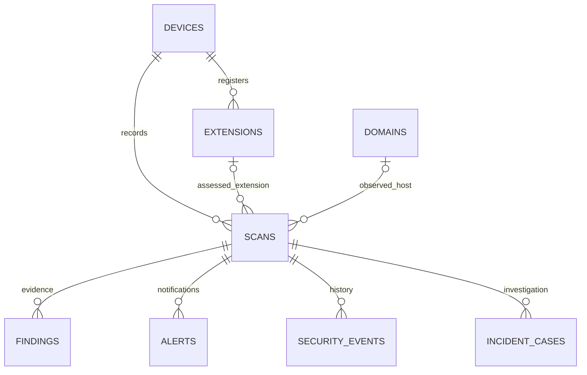

# ExtSecure PostgreSQL database

The local deployment now uses PostgreSQL 18 on `127.0.0.1:5432`, database
`extsecure`. The API continues at `http://127.0.0.1:8765`; the extension's
authentication, approvals and API routes remain compatible.

## Data model and integrity

The live schema contains 41 tables and eight reporting views. Indexes include
primary/unique keys and dedicated device/time/cursor history indexes. It stores
devices, scans, domains, findings, alerts, security events, incidents, approvals,
reports, account/session records and audit history. Risk results remain on the
scan record and are exposed through `extsecure_risk_results`, avoiding a second
independent copy of the score. Scans record the policy version used to assess them.

Foreign keys link scans to devices and domains and findings/alerts to their
scans. Checks reject invalid scores, severities, completeness states and target
types. A unique hostname constraint and transactional upserts prevent duplicate
domains during concurrent scans. Domain first/last-seen timestamps remain correct
when events arrive out of order. Scan recording and its related findings, alerts
and events use the existing shared transaction.

Composite foreign keys also enforce attribution: an extension belongs to the
scan's device, and findings/events belong to their scan's device. When a child
record names an extension, it must match the extension on the parent scan.
An omitted extension remains valid for URL scans and device-level events.
Findings reject points outside 0–100; alerts reject unrecognized statuses;
domain timestamps cannot run backward. The database rejects inconsistent writes
even if a future API integration bypasses the existing validation code.

Domain tracking respects the hostname privacy setting. URLs are normalized;
embedded credentials, query strings and fragments are excluded from domain
records. Retention removes old orphaned domains without deleting domains still
referenced by retained scans.

## Queries

- [Schema](../sql/schema.sql): complete PostgreSQL DDL for a new empty schema.
- [Queries](../sql/queries.sql): parameterized scan history, findings, domain,
  alert, report and audit queries.
- [Python queries](../src/alba_security/database_queries.py): bounded history
  and aggregate queries, hostname normalization and transactional domain upserts.

Views: `extsecure_risk_results`, `extsecure_scan_history`,
`extsecure_alert_history`, `extsecure_daily_statistics`,
`extsecure_weekly_statistics`, `extsecure_monthly_statistics`,
`extsecure_scan_evidence`, `extsecure_domain_risk`.
Periods use UTC and half-open ranges. Aggregates count scans independently of
findings and alerts, preventing duplicate counts. Unknown results remain distinct
from high-risk detections. Account authorization still applies through the API;
these SQL views are for trusted backend use, not direct extension access.

`scan_history_page` uses a timestamp/ID cursor with stable descending ordering,
including scans created at the same instant. It caps pages at 500 records and
retains the requested device/time scope on every page. A cursor is a position,
not an access grant. Callers must authorize the scope before executing queries.
`report_totals_query` counts each child collection independently, including the
selected device scope; `domain_risk_query` ranks domains within a bounded period.
Bucket views represent whole UTC days/weeks/months; use exact-range helpers for
partial periods. These helpers are backend building blocks; this change does
not add new extension endpoints or alter account permissions.



## Local Windows setup

Install dependencies from `requirements.txt` using the project's Python environment.
Run from the project root:

```powershell
& .\scripts\enter_postgresql_credentials.ps1
$env:PYTHONPATH = "$PWD\src"
python .\scripts\setup_postgresql.py
python .\scripts\activate_postgresql.py
```

The first script prompts for the existing administrator password with masked
entry. It does not reset the PostgreSQL password or change authentication rules.
Encrypted credentials and generated role passwords are stored under `.private`
using Windows DPAPI, tied to this Windows account. Keep these files and `.env`
out of Git. `.env` contains the private runtime connection string.

Setup creates a dedicated owner `extsecure_owner` and runtime `extsecure_app`.
Neither is a superuser nor can create databases or roles. The runtime can read
reporting views and perform application DML, but cannot create tables.
`governance_audit` and `admin_override_audit` permit runtime reads and inserts;
updates, deletes and truncation are denied. This protects audit rows from runtime
modification; the database owner still has maintenance authority.

Activation supports this local Windows deployment and its existing file-backed
SQLite database. It stops only a recognized Uvicorn API on port 8765, takes a
SQLite backup, and imports into an empty PostgreSQL destination in one transaction.
Every table's count and canonical row digest must match before commit. Existing
accounts, sessions and encrypted authenticator records are preserved. A populated
destination is rejected rather than overwritten. Re-running activation after a
successful switch does not import again.

Backups and verification are under `.private/updates/postgresql-*` and
`.private/postgresql-migration-verification.json`. The original SQLite database is
retained. If activation/startup fails, the script restores the previous `.env` and
attempts to restart SQLite. A committed PostgreSQL import may remain for inspection;
do not retry an import into it or delete it without checking the failure.
After successful activation, SQLite is a historical backup, not a live replica.
Switching back later requires reconciling any new PostgreSQL records first.

## Updating an existing PostgreSQL deployment

```powershell
$env:PYTHONPATH = "$PWD\src"
python .\scripts\upgrade_postgresql.py
python .\scripts\check_database.py
```

The upgrade briefly stops the recognized local API, writes a private custom-format
`pg_dump` backup, applies additive constraints/indexes/views with the owner role,
and verifies every existing row using counts and SHA-256 digests. Existing
conflicting data causes validation to fail; records are never silently rewritten.
An advisory transaction lock serializes schema changes and a five-second lock
timeout avoids waiting indefinitely on active readers. Keep the private dump and
verification file for recovery. The tool attempts to restart the API in its
cleanup path; check API health after a failed upgrade. It does not automatically
restore a database dump or overwrite new data.

`check_database.py` reports missing tables, named constraints, indexes/views,
device/extension attribution errors, table counts and runtime capabilities.
It uses read-only transactions and emits no passwords, session tokens or stored
record content. Exit code 1 indicates an incomplete schema or integrity error.
The schema revision reported is the code's expected revision, not a database
migration ledger. `export_database_schema.py` regenerates the empty-database SQL
artifact deterministically from the same model definitions and views.

PostgreSQL enforces named checks and composite relationships directly; legacy
SQLite files retain the earlier additive upgrade path and are not rebuilt to
retrofit every new constraint. New SQLite test databases use the full model.

## Verification

Original PostgreSQL integration: **7 passed**, covering foreign keys/check constraints,
concurrent domain inserts, reporting boundaries, transaction rollback, full
SQLite migration plus authenticated API access, forced digest-mismatch rollback,
and restricted runtime/audit permissions. Test runs used disposable
`extsecure_test_*` databases, removed afterward. SQLite compatibility suites also
passed (99 tests; a subsequent focused API/governance/query run passed 55).
The live migration verified all 41 tables and confirmed a PostgreSQL connection
from `ExtSecure API` using `extsecure_app`, API health, workflow readiness and
unauthenticated request rejection. Private records and credentials were not published.

The professional database revision additionally tests cross-device and extension
attribution, owner upgrade repeatability, rejection of conflicting legacy rows,
domain time order, alert/finding validation, cursor pagination and evidence counts.
See [professional upgrade verification](Database%20Upgrade%20Verification.md) for
the final test counts and live deployment results.

Reference documentation: [PostgreSQL role permissions](https://www.postgresql.org/docs/18/sql-createrole.html)
and [SQLAlchemy PostgreSQL dialect](https://docs.sqlalchemy.org/en/20/dialects/postgresql.html).
Composite relationship design follows [PostgreSQL constraints](https://www.postgresql.org/docs/18/ddl-constraints.html);
history indexes follow [multicolumn index documentation](https://www.postgresql.org/docs/18/indexes-multicolumn.html).
